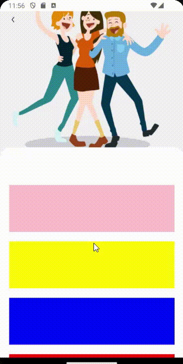

- A collapsing image by scrollview's scroll Y.

- It comes with a built-in TypeScript typings and is compatible with all popular JavaScript frameworks. You can use it directly or leverage well-maintained wrapper packages that allow for a more native integration with your frameworks of choice.

# Example:




## How to use:

```
  <CollapsingScroll
      scrollProps={{ contentContainerStyle: { paddingBottom: 16 } }}
      onClickBack={onclickBack}
      showBackButton
      image={() => (
        <Image
          style={{ width: '100%', height: '100%' }}
          source={require('@equalbill/assets/images/friends.png')}
        />
      )}
    >
     <>
        <View style={{ height: 100, width: '100%', backgroundColor: 'pink', marginBottom: 20 }} />
        <View style={{ height: 100, width: '100%', backgroundColor: 'yellow', marginBottom: 20 }} />
        <View style={{ height: 100, width: '100%', backgroundColor: 'blue', marginBottom: 20 }} />
        <View style={{ height: 100, width: '100%', backgroundColor: 'red', marginBottom: 20 }} />
        <View style={{ height: 100, width: '100%', backgroundColor: 'blue', marginBottom: 20 }} />
        <View style={{ height: 100, width: '100%', backgroundColor: 'purple', marginBottom: 20 }} />
        <View style={{ height: 100, width: '100%', backgroundColor: 'black', marginBottom: 20 }} />
      </>
    </CollapsingScroll>
```

# CollapsingScroll Props -

| Name               | Type              | Default |
| ------------------ | ----------------- | ------- |
| image              | () => JSX.Element |
| imageStyle         | ViewStyle         |
| imageBackStyle     | ViewStyle         |
| conainerStyle      | ViewStyle         |
| scrollStyle        | ViewStyle         |
| scrollProps        | ScrollViewProps   |
| dataContainerStyle | ViewStyle         |
| showBackButton     | boolean           |
| backButton         | () => JSX.Element |
| onClickBack        | () => void        |
| imageHeight        | number            |
| children           | any               |
